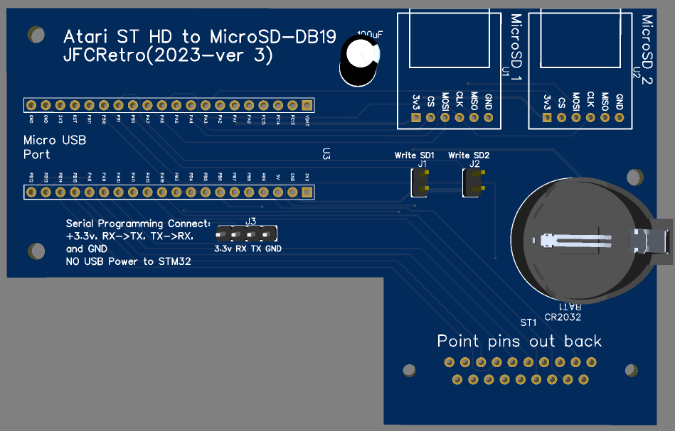
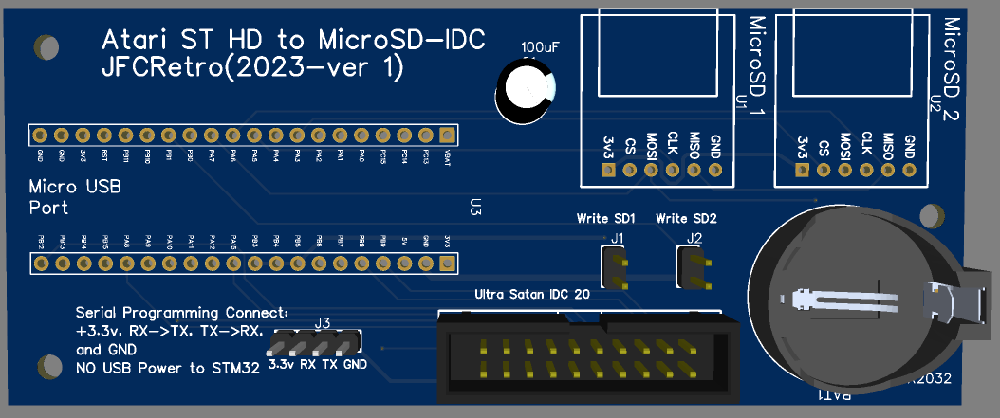

# acsi2stm-alt-hardware
Alternate PCB designs for the acsi2stm using a db-19 or and IDC-20 connector

  - **db19**: contains the EasyEDA schematics and PCB layout for the DB19 board
  
  - **idc20**: contains the EasyEDA schmeatics and PCB layout for the IDC20 board
  
  - **gerbers**: contains various standard generated PCB gerber files as zip files

# Description
The db19 uses soldered in pins that will plug into the Atari ST's DMA port while the IDC-20 uses and Ultrasatan style IDC-20 and ribbon cable to connect to the ST's DMA port.  

The Ultrasatan style board can be found here:  https://github.com/jfceklosky/idc2ribbon

These boards can be used with the software from this project:
  https://github.com/retro16/acsi2stm
Versions 3.X and 4.X will work.

# Building
The gerbers can be used with various PCB manufacturers like JLBPCB, PCBway, and others.

Part links:

# Board Images
**DB19** 

**IDC20**

